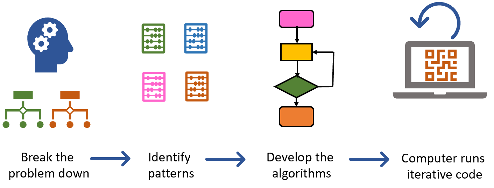
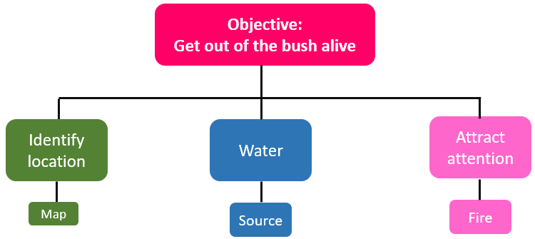

::::::::::::::::::::::::::::::::::::::: objectives

- Understand the difference between programming and computational thinking
- Recognize how computational thinking is applied in everyday life
- Learn the steps of computational thinking such as problem breakdown, pattern recognition, and developing algorithms

::::::::::::::::::::::::::::::::::::::::::::::::::

:::::::::::::::::::::::::::::::::::::::: questions

- What is the difference between programming and computational thinking?
- How is computational thinking used in daily life?
- What are the steps involved in computational thinking?
- How can structure diagrams help in breaking down problems?

::::::::::::::::::::::::::::::::::::::::::::::::::

While thinking computationally is a prerequisite for programming, programming and computational thinking are not the same thing.

| **Programming** | &nbsp; |  **Computational thinking** |
| :---: | :---: | :---: | 
| instructs a computer to carry out a sequence of steps in a particular order. | &nbsp; | is the process that helps decide what those steps will be, i.e.  what the computer will be told to do. |      

------

Computers are precise, and computing instructions must be clear and unambiguous, as the computer cannot think - it can only follow orders. Unlike humans, computers do not get bored or distracted, they process data very quickly, and will carry out the same tedious, repetitive tasks over and over again without making mistakes.

{alt="Computational thinking at work" width="100%"}

#### Computational thinking in our daily lives

Subconsciously, we practise computational thinking every day of our lives. As Jeannette Wing stated: 

*"Computational thinking describes the mental activity in formulating a problem to admit a computational solution. **The solution can be carried out by a human or machine**."*

Every time we need to plan to do something, we use some of the steps of computational thinking such as problem breakdown, pattern recognition and developing algorithms. 

- Project managers use computational thinking to plan complex activities such as building a tunnel or revamping a playground. 

- Epidemiologists use it to identify patterns that help predict how a disease outbreak will spread. 

- Parents use it to juggle work, parenting, community responsibilities and housework.

- Lost hikers can use it to try to find their way out of the forest.

#### Breaking problems down with structure diagrams

When trying to solve problems, it is essential to break them down into their constituent parts. Pasting sticky notes on a wall is one way to visualise the necessary steps. 

Structure diagrams also allow you to plan problem breakdown visually. At the top should be the objective, and the steps underneath should start with high level considerations. These high level considerations can then be broken down into smaller and smaller steps.

In the hiking scenario, the group of four people have to try to solve the problem of being lost. This diagram is the very start of their thinking about their immediate needs. 

{alt="Structure diagram" width="100%"}

---------

:::challenge
## Practice

Imagine that night is now falling fast, and our friends are still stuck in the forest. Add some more detail to the structure diagram to help them survive the night.
:::

:::::::::::::::::::::::::::::::::::::::: key points

- Computational thinking involves breaking down problems, recognizing patterns, and developing algorithms.
- While programming is instructing a computer to carry out tasks, computational thinking helps decide what those tasks will be.
- Computational thinking is used in various fields, from project management to epidemiology, and even in daily tasks.
- Structure diagrams are useful tools for visually breaking down and planning problem-solving steps.

::::::::::::::::::::::::::::::::::::::::::::::::::

