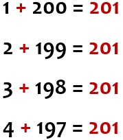

::::::::::::::::::::::::::::::::::::::: objectives

- Apply decomposition, pattern recognition, and algorithms to both mathematical and real-world problems.
- Understand how abstraction allows us to create reusable formulas and processes.
- Learn the "Library Sort" algorithm as an application of computational thinking.

::::::::::::::::::::::::::::::::::::::::::::::::::

:::::::::::::::::::::::::::::::::::::::: questions

- How can we use computational thinking to solve complex manual tasks?
- What is "Library Sort" and how does it optimize shelving?
- Can the same computational strategies apply to both math and physical organization?

::::::::::::::::::::::::::::::::::::::::::::::::::

In this exercise, we will see how computational thinking can be used to add up all the numbers between 1 and 200 in our heads, i.e. `1 + 2 + 3 + 4` and so on. We should be able to do this in less than a minute. 

Seems impossible?

It's not.

Using the first computational thinking step - *Decomposition* - we break the problem up into smaller pieces. Rather than trying to add the numbers up sequentially, which would be challenging for many people to do in their heads, let's approach the task in a different way.

::::::::: challenge

## Decomposition

Let's begin at each end of the 1-200 sequence by adding up the first and last numbers.

What is `200 + 1`? 

:::::::: solution
The answer is `201`.
:::::::

Let's now add up the second and the second last numbers, i.e. `199 + 2`. 

:::::::: solution
The answer is `201`.
:::::::

Let's now add up the third and the third last numbers, i.e. `198 + 3`. 

:::::::: solution
The answer is `201`.
:::::::

:::::::::

-------

### Pattern recognition

Using our second step - *Pattern recognition* - we should be able to spot a clear pattern, i.e. that each pair of numbers appears to add up to `201`.

{alt="Spotting a pattern" width="25%"}

If we follow this same process with **all** the numbers between 1 and 200, we will end up with **100 pairs**, each of which will add up to `201`.

-------

### Algorithm

Using an *Algorithm* - another name for a series of steps - how do we calculate the final total?

We multiply the `number of pairs` (100) by `201` (the total to which each pair adds up).

`100 * 201` gives us the answer of `20,100`.

So far, so good.

Now, what about about our fourth step, *Abstraction*? 

-------

### Abstraction 

*Abstraction* will enable us to generalise from that experience, i.e. repeat the process we used to add up all the numbers between 1 and 200 to add up a *different* set of numbers, e.g., 1-500.

The *Algorithm* will be 

(`number to be added` divided by 2) multiplied by (`number to be added` +1). We can express that as an algebraic formula:

`(x/2) * (x + 1)`

where *`x`* is the `number to be added`.

-------------

That's it! Using those four key steps, we have learned the basics of computational thinking.

---------

::::::::::::::::::::::::::::::::: challenge

## Option 1: Practice with Numbers

Use the algorithm above to add up all the numbers between 1 and 24, 1 and 50, and 1 and 1,000.

:::::::: solution

**1 to 24:**
- x = 24
- (24 / 2) * (24 + 1)
- 12 * 25 = **300**

**1 to 50:**
- x = 50
- (50 / 2) * (50 + 1)
- 25 * 51 = **1,275**

**1 to 1,000:**
- x = 1000
- (1000 / 2) * (1000 + 1)
- 500 * 1001 = **500,500**

::::::::::::::::

::::::::::::::

::::::::::::::::::::::::::::::::: discussion

## Discussion: Odd Numbers

The numbers above are all even numbers. What would be the process for adding up numbers if the final number is an odd one, e.g., 17? Can you use the same formula? If not, what adaptations would you need to make to the formula?

:::::::: solution

Yes, the formula `(x/2) * (x + 1)` still works mathematically.

**For 17:**
- x = 17
- (17 / 2) * (17 + 1)
- 8.5 * 18 = **153**

**Conceptually:**
If you prefer the "pairing" method (Decomposition):
- You have 8 pairs (1+17, 2+16, etc.) that sum to 18.
- The middle number, 9, is left over.
- (8 * 18) + 9 = 144 + 9 = **153**.

Both methods yield the same result. The abstraction formula handles the "half pair" (0.5) correctly.

::::::::::::::::

:::

::::::::::::::::::::::::::::::::: challenge

## Option 2: Shelving Books Efficiently

Imagine you are working in a library. You have a cart of new books that need to be shelved. The shelves are currently quite full. Every time you find the correct spot for a new book (e.g., by call number), you have to shift all the subsequent books on that shelf to the right to make space. This physical shifting is heavy, slow, and tedious.

How can you use **Computational Thinking** to solve this problem for future shelving? Apply the four steps:

1.  **Decomposition:** What are the individual actions involved in shelving?
2.  **Pattern Recognition:** What is the specific bottleneck that repeats?
3.  **Abstraction:** Can we conceptually change how the shelf "works"?
4.  **Algorithm:** What new process can we adopt to minimize the work?

*Hint: Think about "Gapped Insertion Sort" or "Library Sort".*

:::::::: solution

1.  **Decomposition:** Shelving involves three main actions: (a) Finding the correct spot, (b) Making space (shifting existing books), and (c) Placing the new book.
2.  **Pattern Recognition:** The "Making space" step is the bottleneck. It requires physical effort and time, and it happens *every single time* we insert a book into a contiguous row. The more books on the shelf, the more work it takes to shift them.
3.  **Abstraction:** Instead of viewing the shelf as a solid block of books that must be packed tightly, view it as a collection of items with *buffers* or *gaps* distributed between them. The "concept" of the shelf now includes empty space as a feature, not a bug.
4.  **Algorithm (The Library Sort):**
    *   **Step 1 (Setup):** Spread the existing books out on the shelves so there are intentional gaps between them (e.g., leave 25% of the shelf empty).
    *   **Step 2 (Insert):** When a new book arrives, place it into the open gap at its correct location. **No shifting is required!**
    *   **Step 3 (Maintenance):** If a specific gap fills up completely, redistribute just the books in that small section to create new gaps.

By using this algorithm, you trade a small amount of space (the gaps) for a massive gain in speed and reduced effort. In computer science, this is known as a **Gapped Insertion Sort**.

::::::::::::::::

::::::::::::::

:::::::::::::::::::::::::::::::::::::::: keypoints

- Computational thinking helps us calculate sums efficiently without adding every number sequentially.
- Decomposition reveals patterns (pairing numbers).
- Algorithms provide a reproducible process.
- Abstraction creates a formula reusable for any set of numbers.

::::::::::::::::::::::::::::::::::::::::::::::::::
